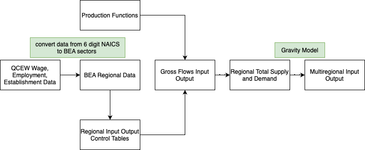

# Tapestry: Greg Alward & Phil Watson

This repository houses Python code for the Tapestry project conducted by Greg Alward and Philip Watson at the University of Idaho.

## What is Tapestry?

Tapestry is a USDA-NIFA funded project to develop a transparent, open-access to an array of in-situ data, analysis protocols and analytic services that enables researchers, extension professionals and policy makers to investigate interregional, intertemporal and intersectoral relationships at county-level regional economies of the United States.

Enabling open-access experiments with replicable sets of cross-sectional and time-series accounts will allow new insights into the causes and nature of income growth across the nation, differences in income distribution across the nation, differences in wealth distribution across the nation, calculating consistent economic contributions and impacts, and measures of the economic interdependency of different regions.

## Resources

- [Tapestry Data Tools](https://tapestry.nkn.uidaho.edu)
- [Tapestry Website](https://www.uidaho.edu/cals/tapestry)

## Tapestry Work Flow

